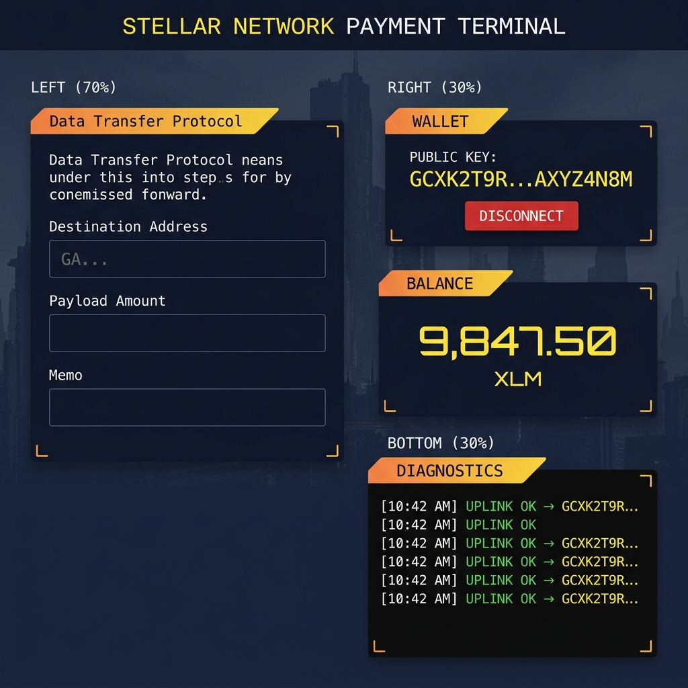
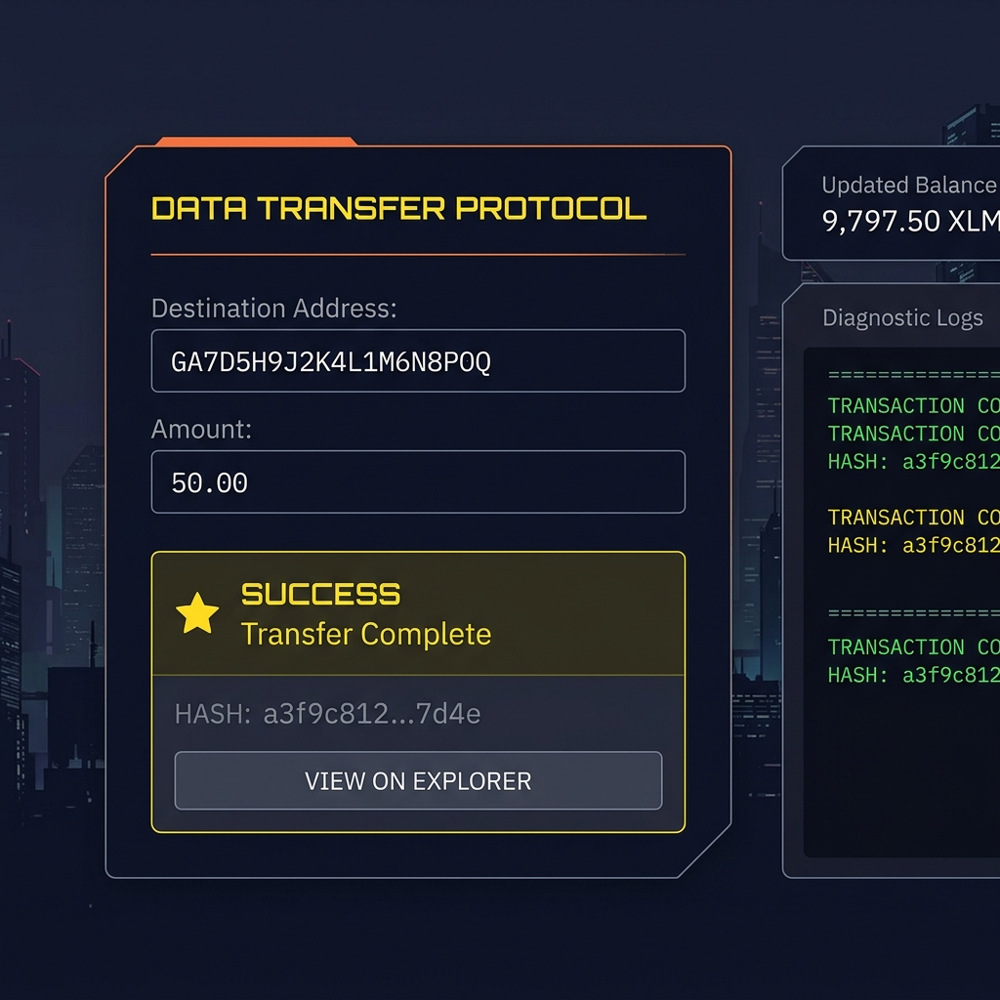
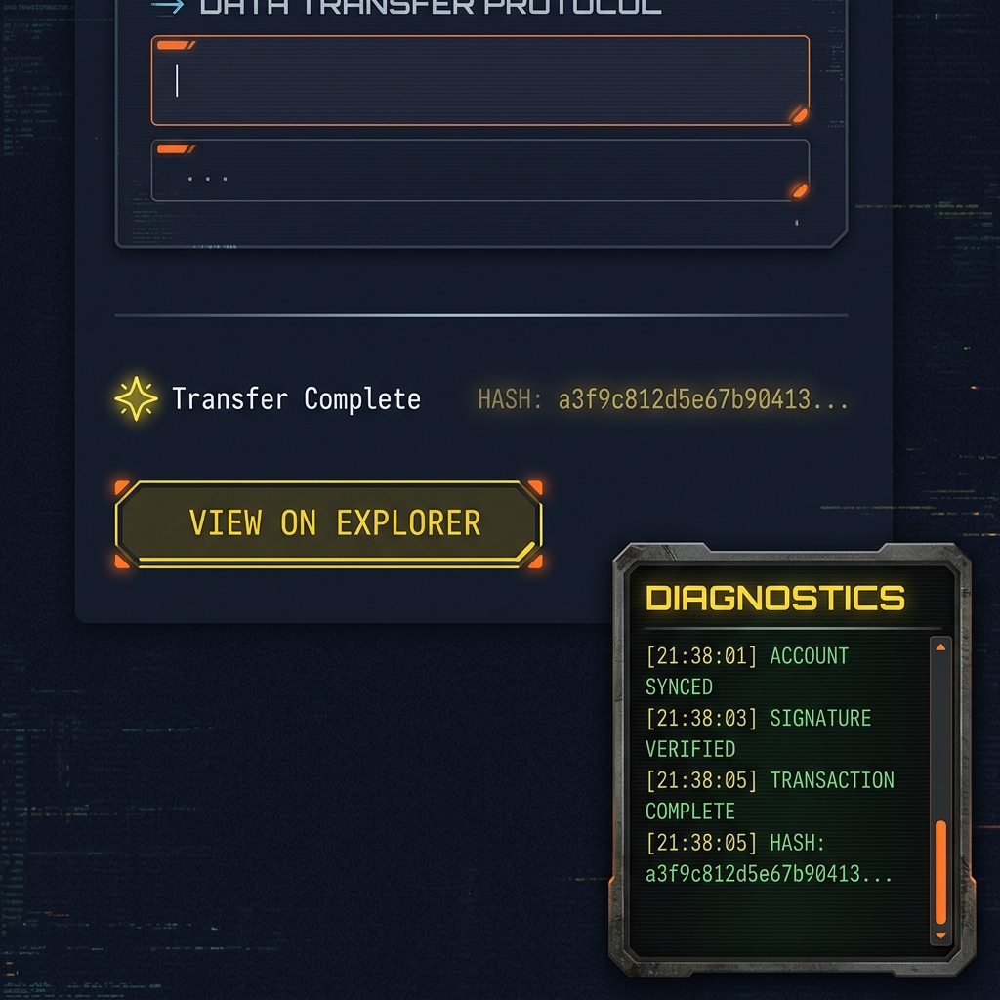

# 🚀 Stellar Network Payment Terminal

A decentralized payment terminal for the **Stellar Testnet** built with React + Vite. Connect your [Freighter wallet](https://www.freighter.app/), view your XLM balance, and send payments — all through a dystopian-themed terminal interface.


---

## ✨ Features

- **🔗 Freighter Wallet Integration** — Connect/disconnect your Stellar wallet via the Freighter browser extension
- **💰 Real-Time Balance** — Fetch and display your Testnet XLM balance from Horizon
- **📤 Send Payments** — Transfer XLM to any Stellar address on the Testnet
- **📋 Transaction Logs** — Live diagnostic console showing all operations and errors
- **🔍 Explorer Links** — View completed transactions on Stellar Expert
- **🎨 Dystopian UI** — Immersive dark terminal aesthetic with CRT scanlines, glassmorphism cards, and animated effects
- **📱 Responsive** — Adapts from desktop two-column layout to single-column on mobile
- **🛡️ Error Boundary** — Graceful crash recovery with themed error screen

---

## 🛠️ Tech Stack

| Technology | Purpose |
|---|---|
| [React 19](https://react.dev/) | UI framework |
| [Vite 8](https://vitejs.dev/) | Build tool & dev server |
| [@stellar/stellar-sdk](https://www.npmjs.com/package/@stellar/stellar-sdk) | Stellar blockchain interactions |
| [@stellar/freighter-api](https://www.npmjs.com/package/@stellar/freighter-api) | Freighter wallet integration |
| [Horizon Testnet](https://horizon-testnet.stellar.org) | Stellar Testnet API endpoint |

---

## 📦 Setup Instructions

### Prerequisites

- **Node.js** v18+ and **npm** v9+
- **Git** installed
- **Freighter** browser extension ([Install here](https://www.freighter.app/))

### 1. Clone the Repository

```bash
git clone https://github.com/Dark-97o/Stellar_Project.git
cd Stellar_Project
```

### 2. Install Dependencies

```bash
npm install
```

### 3. Run Locally

```bash
npm run dev
```

The app will be available at **http://localhost:5173**

### 4. Set Up Freighter Wallet

1. Install the [Freighter browser extension](https://www.freighter.app/)
2. Create a new wallet and set a password
3. **Switch to TESTNET**: Settings → Network → Select **TESTNET**
4. **Fund your account**: Copy your public key and visit:
   ```
   https://friendbot.stellar.org/?addr=YOUR_PUBLIC_KEY
   ```
   This gives you 10,000 free test XLM

### 5. Connect and Use

1. Open `http://localhost:5173` in the same browser with Freighter
2. Click **Link Freighter** → Approve the connection in the Freighter popup
3. Your balance will appear automatically
4. Enter a destination address and amount to send a test transaction

---

## 📸 Screenshots

### Wallet Connected State

After clicking "Link Freighter" and approving the connection, the wallet public key is displayed and the status indicator turns active.



### Balance Displayed

The balance card shows your current XLM balance in large Orbitron font, fetched directly from the Stellar Horizon Testnet API.


### Successful Testnet Transaction

After submitting a transfer, the transaction is signed via Freighter and submitted to the Stellar Testnet. A success confirmation appears with the transaction hash.



### Transaction Result

The completed transaction result shows the full hash and a link to view the transaction on Stellar Expert. The diagnostics panel logs every step of the process.



---

## 📁 Project Structure

```
Stellar_Project/
├── public/
│   └── dystopian-bg.png        # Background image
├── src/
│   ├── assets/                 # Static assets
│   ├── utils/
│   │   └── stellar.js          # Stellar SDK & Freighter API logic
│   ├── App.jsx                 # Main app component + Error Boundary
│   ├── index.css               # Complete design system & styles
│   └── main.jsx                # React entry point
├── screenshots/                # README screenshots
├── index.html                  # HTML entry point
├── vite.config.js              # Vite configuration with Node polyfills
├── package.json                # Dependencies & scripts
└── README.md                   # This file
```

---

## 🔧 Key Implementation Details

### Wallet Connection Flow (`stellar.js`)

```
isConnected() → requestAccess() → getAddress() → loadAccount()
```

1. **`isConnected()`** — Checks if Freighter extension is installed
2. **`requestAccess()`** — Triggers the Freighter popup for user authorization
3. **`getAddress()`** — Retrieves the user's public key (fallback)
4. **`loadAccount()`** — Fetches account data from Horizon Testnet

### Payment Flow

```
loadAccount() → buildTransaction() → signTransaction() → submitTransaction()
```

1. Build a Stellar `TransactionBuilder` with the payment operation
2. Sign via Freighter's `signTransaction()` (user approval in extension)
3. Submit the signed XDR to the Horizon Testnet server
4. Display the result hash with an explorer link

---

## ⚠️ Important Notes

- This app runs on the **Stellar Testnet** — no real funds are involved
- Freighter must be set to **TESTNET** mode to work with this app
- Fund your testnet account via [Friendbot](https://friendbot.stellar.org) before transacting
- The minimum balance for a Stellar account is **1 XLM** (testnet)

---

## 📜 License

This project is licensed under the terms specified in the [LICENSE](./LICENSE) file.

---

## 🤝 Contributing

Contributions are welcome! Please open an issue or submit a pull request.

---

<p align="center">
  <b>Stellar Network Payment Terminal</b> — Built with ❤️ on the Stellar Testnet
</p>
